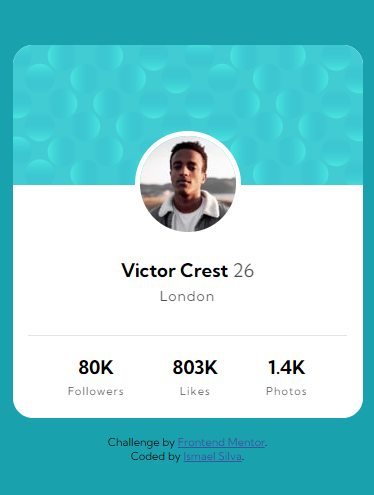

# Frontend Mentor - Cartão de Perfil

## Bem-Vindo(a)! 👋

Frontend Mentor são desafios para programadores praticarem e aprimorarem seus códigos com desafios do básico ao avançado.

[Frontend Mentor](https://www.frontendmentor.io).

## Desafio

Como já diz no título, eu tive que fazer um "cartão de perfil". Nesse desafio foi necessário montar a estrutura HTML e fazer a estilização CSS.

## Processo

Eu fiz e refiz toda a estrutura da página pensando da melhor forma possível para uma boa estilização. Quando consegui uma boa estrutura, estilizei todos os elementos indo de forma ao efeito cascata do próprio CSS, ou seja, comecei de pai para filho em uma ordem de hierarquia.
Finalizando toda a parte de HTML e CSS na resolução Desktop, pulei para a responsividade, que no caso não precisei fazer muita coisa. Ele me atendeu muito bem com uma resolução pequena (375px), só precisei centralizar o link fora do cartão.

## Resultado

### Desktop

### Mobile

## Ferramentas Utilizadas

- Marcação HTML5 semântica
- Propriedades personalizadas do CSS

## Aprendizado!

Por mais que a gente estude e tenha uma ideia de como as coisas funcionam, na prática é muito diferente. Eu fiz a estrutura HTML e fiz a estilização CSS, porém, eu notei que minha estrutura não estava boa o suficiente então fiz novamente e refiz mais umas dezenas de vezes. Fui percebendo pela ordem de hierarquia no próprio CSS e principalmente pela ferramenta de navegação "Dev Tools" que tinha problemas na estrutura da página, pois sempre notava que cada espaço deveria conter um pai e um filho ou um grupo de filhos para a melhor organização possível.

Após consegui montar uma boa estrutura fiz a estilização ( que na verdade não me deu muita dor de cabeça ). Na estilização eu conseguia entender mais ou menos o que estava se passando dentro dos containers, e quando não entendia sempre olhava pelo "Dev Tools" ( que a propósito ajuda para um caramba ) então eu estilizei a página ( lógico que não foi tão fácil. Pesquisei bastante ) e consegui ter um bom resultado ! Não fiz a parte de "Background" do desafio, tentei várias e várias vezes tanto pelo HTML quanto pelo CSS, mas senti bastante difuldade.
